# git 工作流 

## 1. 工作环境

- 所需下载的软件：**vscode 、git、一个能用的梯子** 

- 前置工作：注册github 、在vscode 中安装插件：**gitlens** 、 额外的推荐 **githistory** ，然后完成gitlens和你的github账号同步

  另外非常推荐的 copliot （强大的ai，可以帮助你更好的瞎折腾，下面有哪一步没成功也可以问，和一些原理，当然也可以直接把步骤记住，无需深究其工作流程）

## 2.开始操作

### 2.1 确认工作

gitlens 然后在setting中 添加git 的 安装地址

然后打开终端（Powershell），输入

> 打开终端 win + r 打开面板，再输入 cmd 就可以打开 powershell了

```bash
git --version
```

查看是否成功 安装，如果没有，不必担心，一般是没有添加环境变量，自己搜搜怎么添加git的路径到系统的环境变量

重新输入，有输出版本号- - - ok

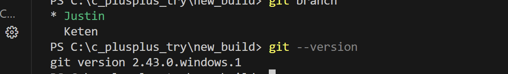

### 2.2 注册工作

然后就是git的注册工作，这一步可以自行查找git安装注册教程，只需学到绑定账号邮箱那一步即可 

### 2.3 本地项目准备

从将项目整个推送到 本地仓库开始 

先进行 git仓库初始化 ，**将你所在的工作空间初始化为git仓库**

```bash
git init
```

然后创建README.md 文件（写上你关于项目的描述），并将其提交到 **暂存区**

```bash
git add .\README.md
```

将 **暂存区** 中的 东西提交 到 **本地仓库**的分支上

 (注意这里是将所有 暂存区的东西都 放进去)

```bash
git commit -m "将readme提交到本地仓库"
```

创建**本地分支**

==**注意**==，这里有一个隐藏的点，当你使用git init 时，Git 其实为你创建了默认分支；包括你刚刚commit 的 readme也是提交到了这个默认分支

*而这个分支在旧版本的 Git 中，为master 分支*

*在新版本的 Git 中，为 main分支*

> 那么就有疑问了，为什么我一开始 git init 之后，输入 git branch 没有显示我的当前分支呢？
>
> **这是 因为你还未向 分支提交任何东西，所以Git 创建的分支 不会显式存在**

使用 ==branch== 命令，创建分支

```bash
git branch Keten
```

当然我们之前也提到 git init 是会 自动创建一个的，而这个在你往这个分支提交东西之前，都是非显式存在的，所以你可以使用下面这条命令**来进行 直接覆盖重命名**

```bash
git branch -M Keten 
```

==使用这条语句 可以直接将当前分支(main) 重命名为 Keten==

而且，如果你的本地仓库下已经存在一个 Keten 分支 ，那么这个操作 会把你当前这个创建的分支直接覆盖掉以前创建的 Keten 分支

对于前面那条命令，**只是创建了分支，但是你当前所处的分支还未改变**，当然还有一条偷懒的，可以实现 **创建 并 切换分支**：

```bash
git checkout -b 本地分支名
```

然后就是一些常见的指令积累

```bash
# 查看当前有什么分支
git branch
# 切换当前分支
git checkout 目标分支
```

### 2.4 链接远程仓库

接下来是去**链接 远程仓库**，使用以下命令：

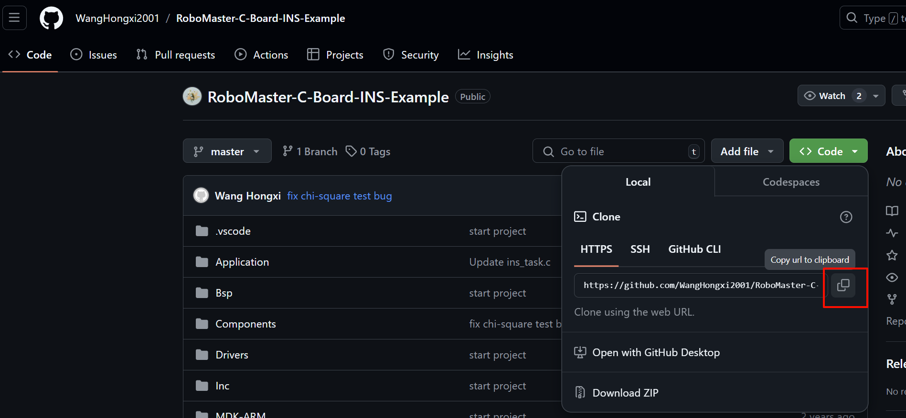

```bash
# git remote add 'your_name_for_extern_repositories' 你的仓库URL，就是上图那里的红框
git remote add origin https://github.com/KetenBieber/Test_Log.git
```

这样就可以完成远程仓库的链接

需要注意：**这个操作是对整个工作空间的操作，而不是对某个分支的单独操作**

**==一旦添加了远程仓库，所有的本地分支都可以与这个远程仓库进行交互==**

### 2.5 和远程仓库中的远程分支的交互

讲解：说说这个 **跟踪** 的概念：

​	跟踪，即跟踪 目标的变化，==也就是说别人更新了什么，我们这边很快就能知道并且重新获取==

> 1. **简化推送和拉取操作**
>
> 当本地分支设置为跟踪远程分支后，你可以使用简化的命令进行推送和拉取操作，而不需要每次都指定远程分支的名称。
>
> 2. **自动合并远程更改**
>
> 使用 `git pull` 命令时，Git 会自动从跟踪的远程分支拉取更改并合并到当前本地分支。这使得保持本地分支与远程分支同步变得更加容易。
>
> 3. **提供分支状态信息**
>
> 当你切换到一个跟踪分支时，Git 会显示该分支与远程分支的同步状态信息，例如是否有未推送的提交或未拉取的更改。

这就是 ==“跟踪”== 这个功能的好处

讲解：接着再讲什么是将 **本地分支 推送到 远程分支**

==简单来说，就是 本来是在你电脑上的文件，通过推送，你就可以在 github 上看到你电脑上的文件==

方便其他人的查看 和 你自己日常的代码管理

```bash
git push origin 本地分支名:远程分支名
```

> 这里再 多嘴一句：`origin` 是 你对远程仓库 的别名，方便你进行对远程仓库中分支的引用

再回到，==怎么实现跟踪：==

第一种是 还未推送到 远程仓库 ，想要顺便推送到远程仓库 并且设置 跟踪关系的，可以使用以下指令

```bash
git push -u origin 本地分支名:远程分支名
```

第二种是 已经推送到 远程仓库，但是未设置 和远程分支的跟踪关系，可以使用以下指令

```bash
# 将本地分支 feature/log-test 设置为跟踪远程分支 origin/feature/log-test：
git branch --set-upstream-to=origin/feature/log-test feature/log-test
```

当进行了追踪之后，以后你只要使用简单的命令就可以完成操作

```bash
# 拉取更改
git pull
# 推送更改
git push
```

最后，也就是**需要开始将你整个工程所作的修改都进行add到暂存区，再提交合并到本地分支，接着合并到远程仓库中的远程分支**

```bash
git add .
git commit -m "your_commit"
git push 
```

### 2.6 远程分支管理：

> 当然也有人会说，远程仓库也有分支阿，那我怎么知道我链接的是哪个分支？
>
> 这就要涉及到了 **Default Branch**，即**默认项**
>
> 如何查看：
>
> 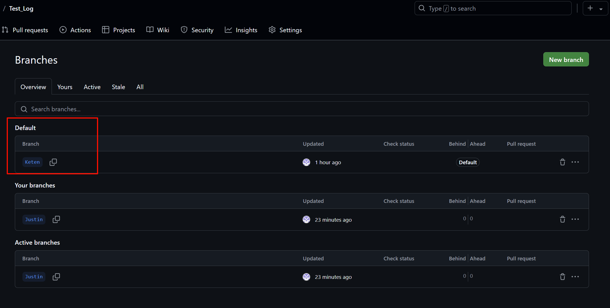

这里显示的就是默认分支，也==就是说 你用 git clone 、git push 都是选择的默认分支==

当然，也可以指定分支 进行操作：

如： clone ==指定==分支

```bash
git clone -b 分支名 https://github.com/KetenBieber/Test_Log.git
```

将**本地分支**推送到 ==指定==**远程分支**

```bash
git push origin 本地分支名:远程分支名
```

将已存在的**本地分支** 和 ==指定==的 **远程分支** 进行链接

```bash
git branch --set-upstream-to=origin/远程分支名 本地分支名 
```

---

## 3. 协作工作

你拿到项目仓库地址之后，需要做什么

### 3.1 

最开始，肯定是要先完成git的注册之类的工作，接着将你所在的工作空间初始化为git仓库

### 3.2

第一步 先拉取工程代码git clone，创建你的本地工作分支，链接远程主分支，然后可以把本地分支推送到远程，这样别人就可以窥视你的分支

**具体操作**：

- 先在github上面 去fork 别人的项目，然后到你fork 的仓库中，去获取你的fork产生的仓库副本URL，用这个东西去git clone

  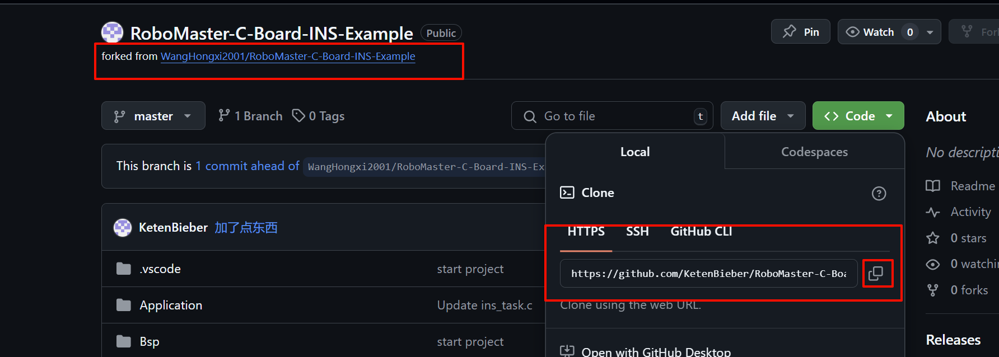

- 在你的电脑上新建一个文件夹

- 然后在vscode 中打开这个文件夹

- 开始git clone

- 之后会有的一个效果：

  只要你成功fork 并且完成本地和远程的链接

  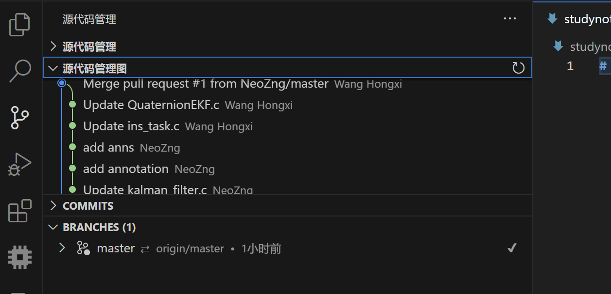

  **可以在这里看到所有仓库的 管理员对项目的历史修改，提交**

补充细节：

通过git clone 

我突然发现，只要使用了git clone ，有一些分支关系会被自动设置，也就是刚刚说的链接：

git clone 之后，输入

```bash
# 查看当前Git仓库中配置的所有远程仓库及其对应的URL。它会列出每个远程仓库的名称和URL，并显示fetch（获取）和push（推送）操作的URL。
git remote -v
```

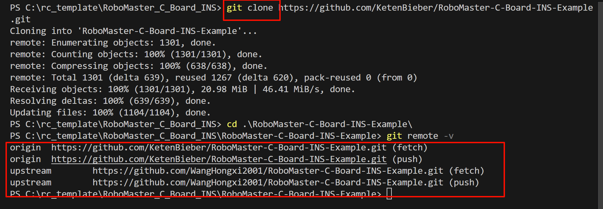

**==所以是非常省事的！==**

这些打印信息的含义是：

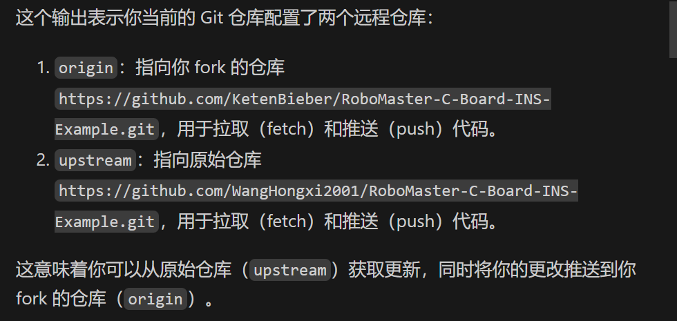

首先要清楚，**origin 和 upstream 都只是一个 别名**，这个 “仓库名” 可能在仓库中并不存在，但是你可以通过这个别名来访问对应关系的远程仓库

你可以做以下操作：

1. 从原始仓库中获取更新：

   ```bash
   git fetch upstream
   git checkout main # 或者是 master
   git merge upstream/main # 或者是 upstream/master
   ```

2. 将本地更改推送到你fork 的仓库

   ```bash
   git push origin <你的分支名>
   ```

3. 创建 Pull Request 

   - 在 Github 上打开你 fork 的仓库页面
   - 创建一个新的 Pull Request ，将你的更改提交到原始仓库

然后就是如果你想监视别人推送到远程的分支，你就可以采取以下操作：

> **获取远程分支信息**
>
> 首先，你需要从远程仓库获取最新的分支信息。可以使用以下命令：
>
> ```bash
> git fetch
> ```
>
> 这个命令会从远程仓库获取所有分支的最新信息，但不会将这些分支合并到你的本地分支。
>
> **查看所有分支**
>
> 你可以使用以下命令查看所有本地和远程分支：
>
> ```bash
> git branch -a
> ```
>
> 这个命令会列出所有本地分支和远程分支。远程分支通常以 `remotes/origin/` 开头。
>
> **切换到远程分支**
>
> 如果你想查看或工作在某个远程分支上，你可以使用以下命令将远程分支检出为本地分支：
>
> ```bash
> git checkout -b <local-branch-name> origin/<remote-branch-name>
> ```
>
> 例如，如果远程分支名为 `feature/log-test`，你可以使用以下命令将其检出为本地分支：
>
> ```bash
> git checkout -b feature/log-test origin/feature/log-test
> ```

​	如果你手贱，乱创分支，然后到最后仓库中分支太多太杂，就可以采取以下操作：

​	    **删除远程分支**

> 先使用指令查看远程分支的数量：
>
> ```bash
> git branch -r
> ```
>
> 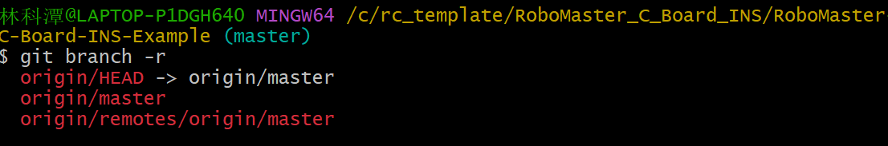
>
> 接着使用指令，进行删除：
>
> ```bash
> git push origin --delete remotes/origin/master
> ```
>
> 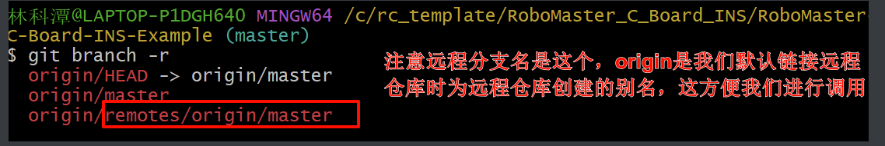
>
> 
>
> > 再补充一点，这个 origin/HEAD 啥呀这是，我在github上也没看到它，我自己也没有去创建过它，为什么会存在？
> >
> > 而且为什么我还删不掉它，提示我 “error: unable to delete 'origin/HEAD': remote ref does not exist”
> >
> > 其实，`origin/HEAD` 并不是一个实际的分支，而是一个符号引用（symbolic reference），它指向默认的远程分支。在你的例子中，`origin/HEAD` 指向 `origin/master`，这意味着 `origin/master` 是默认的远程分支。
> >
> > 在GitHub上，你不会看到 `origin/HEAD` 作为一个实际的分支，因为它只是一个指向默认分支的指针。你只会看到实际存在的分支，例如 `master` 或其他分支

### 3.3 

第二步就是 你每天要写代码前必干的一件事 ：**拉取最新的代码，然后处理冲突**，可以向 最新合并分支的同学询问（但是尽量不要出现这种情况，==每个人一旦要合并代码的时候，必须经过多次测试（在你自己的分支上），并且经过众人讨论过后才可以申请合并！==）

使用vscode 中的 gitlens 插件可以很方便地查看冲突部分，尽量做到我看到 新的代码合并进来，我可以放心地直接自动解决冲突，而不用说需要再来检查你的代码逻辑，这非常低效！

### 3.4

第三步就是开始 在你的分支上干活，测试都在你自己的分支进行测试，经过完整测试之后，合并到你自己的分支，告知其他队员可以帮忙你查看你的分支查看是否有错误

### 3.5

最后**可以发起request**，申请 推送合并到远程仓库中的 主分支，==但是也要记得处理冲突，不要把 主分支的东西误删了 或者把你刚写的东西删了== 

**注：3.3 3.4 3.5 的一些细节都写在 3.2 里面了**

==**这一切操作都可以通过 gitlens提供的图形化工具完成！**==

---

### 3.6 

在这里补充 gitlens上每一步操作对应git 的指令：

gitlens 便捷的可视化：

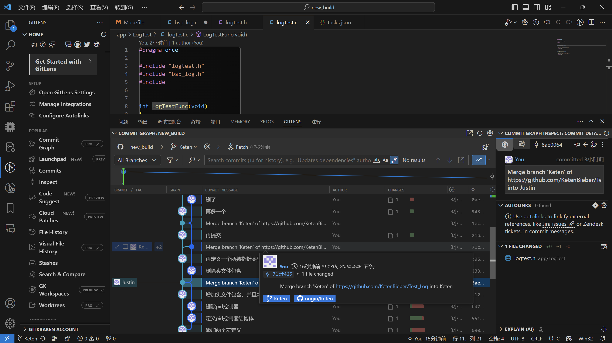

---

首先，比如这里，你更改了代码，并且按下 Ctrl + s 进行保存，这时，左侧“更改”目录下就会出现你对应的修改地方

这非常方便，因为你很有可能一修改就改了很多地方，所以在这里会显示你所做的每一步修改，**当你想要提交到你的本地分支之前，你可以在这里查看所有被修改的东西**

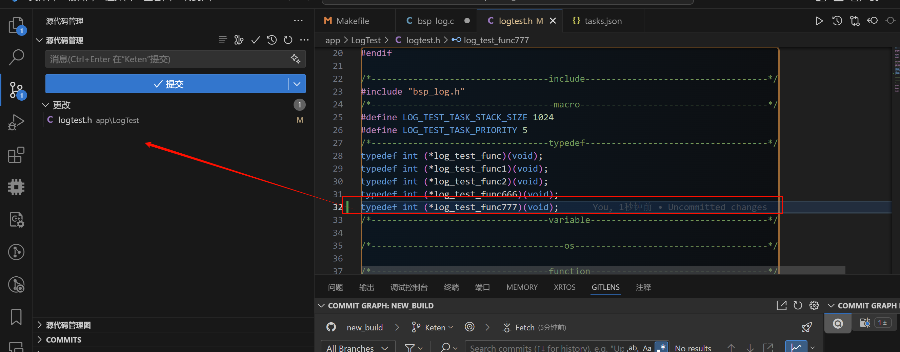

接着，就是进行：

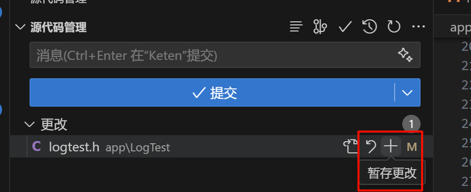

这一步对应的是 `git add `操作，即将本地修改提交到本地暂存区

然后就是提交到本地分支：

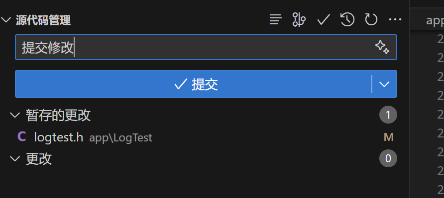

这一步对应的是：`git commit -m “提交修改”`

做完这些，你就完成了到本地仓库的修改：

接着就是合并分支到远程主分支，在这之前，务必先拉取 最新的更新，然后处理“merge”（冲突，如果有的话）

一般去耦合做的好的话，肯定不会出现冲突（因为每个人负责编写的部分都位于不同的地方），所以应该是可以直接 将“从前”合并到“当前”并且保留你新编写的内容

只有同一个代码块有冲突时，才会出现冲突显示：

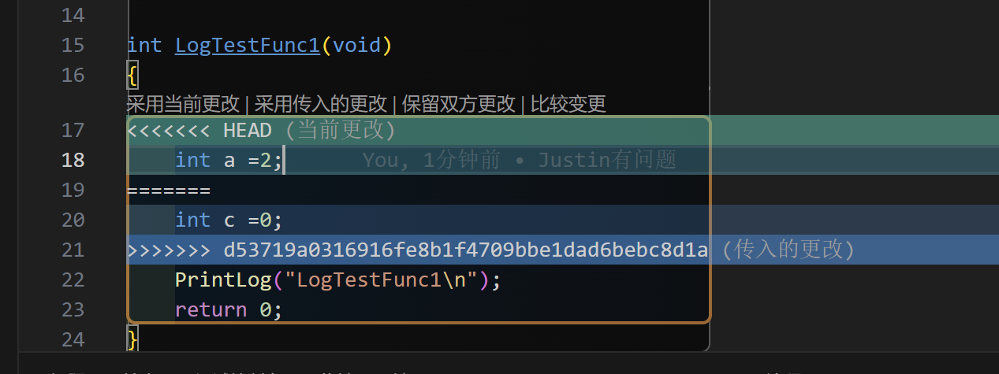

你可以简单的 通过上面的选项，来选择

 **“采用当前更改（远程的被改掉，以你的为最新）”** 

**“采用传入的更改（你的代码被改掉，以远程的为最新）”**

 **“保留双方更改（你和远程的代码同时都被保留吗，叠加）”（最鸡肋的，尽量别用）**

**“比较变更（可以同时打开你当前分支和远程分支的比较，就是比当前页面更加清楚的页面）”**

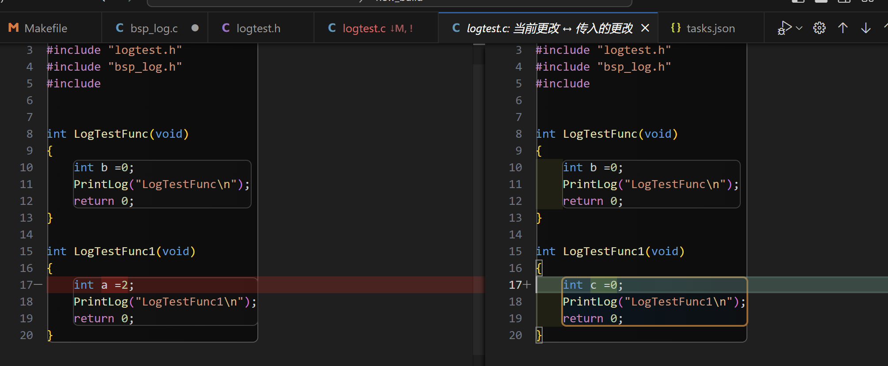

也可以选择屏幕下方出现的：“在合并编辑器中解析”

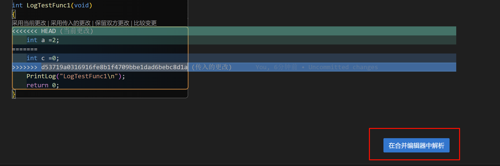

这样可以实现更灵活的操作：==**手动解决冲突**==

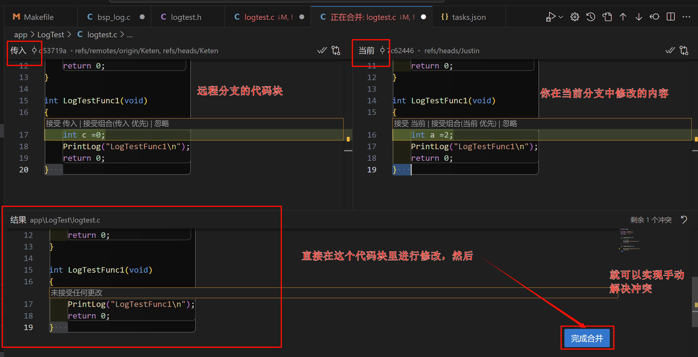

==解决冲突后，就可以进行 push操作了==

这时，另一个跟踪同一个远程分支的 本地分支，就可以直接

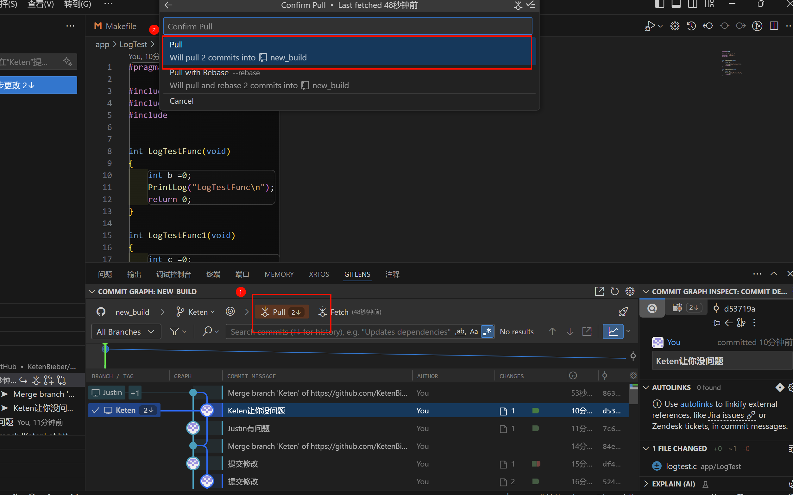

更多gitlens的可视化操作可以自己再去插件官网查询喔，这里只是展示了比较常用的功能

**但还是希望可以去记忆一些git 指令，方便一些快捷操作**,比如一些快速创建分支，链接远程仓库的操作，查看当前分支，切换分支之类的操作，**==切记！不要过分依赖vscode！==**

# 更新一些 GitHub 的机制

## 1. 合并策略

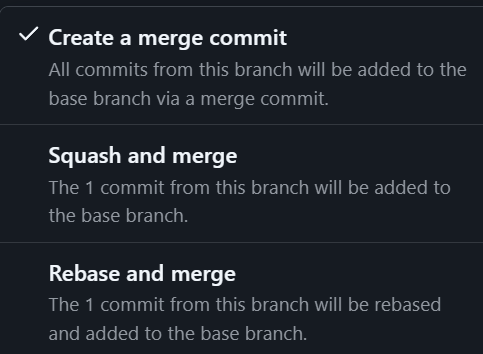

1. **Create a merge commit** 

​	 默认的合并策略，它会创建一个新的合并提交，将 	PR 	的所有提交合并到目标分支中

2. **Squash and merge** 

​	将 PR 中的所有提交压缩成一个提交，然后合并到目标分支中。	

3. **Rebase and merge**

​	将 PR 中的所有提交重新定位到目标分支的顶部，然后合并到目标分支中。==（其实就是添加时间顺序）==

​	但是这样的坏处很明显，就是看不到解决冲突的过程，只适合线性回溯